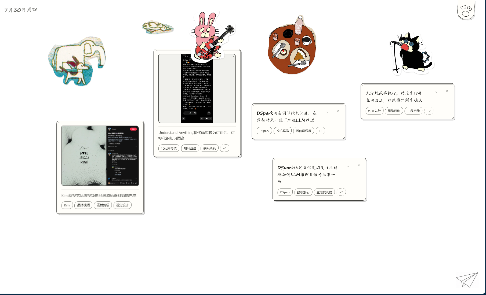

# CtrlV

CtrlV 是一个围绕“粘贴”设计的本地信息桌面。复制文本、网页链接或图片后按下 `Ctrl+V`，内容会保存到当天的纸面，并自动生成摘要和关键词。

## 效果展示



日期白板可以同时组织文本、网页内容、图片与桌面截图，并保留自由排布的视觉空间。

## 功能

- 粘贴文本、公开网页链接、PNG、JPEG 和 WebP 图片
- 在白板粘贴图片时直接生成规整图片卡片，不弹出裁剪界面
- Windows 下随 `run.py` 启动全局截图助手，默认按 `Ctrl+Shift+X` 可从任意软件自由套索并直接贴到白板
- 裁剪素材不套卡片、不生成摘要和关键词；来源标签只在悬浮时显示，并保持屏幕可读大小
- 裁剪素材按选区实际尺寸贴入白板，不再统一放大成固定宽度
- 本地记录来源窗口、应用和裁剪时间，并尽力读取浏览器 URL 或资源管理器选中文件
- 全局截图剪刀以铰链固定跟随鼠标，按平滑轨迹方向转向，并在裁剪过程中掉落少量碎屑
- 全局截图完成选区后，操作栏会自动出现在选区下方或上方，无需移动到屏幕角落
- 白板采用 6000×4000 的世界画布；拖动空白处平移视野，滚轮围绕视野中心缩放全部素材，范围限制为 25%–250%
- 每个日期会保存自己的视野中心和缩放比例；猫爪菜单提供“显示全部”入口
- 卡片使用画布像素坐标，可移动到整张世界画布的任意位置；位置会保存到本地并在下次打开时恢复
- 普通信息卡和双击新建编辑卡会根据窗口宽度自动补偿尺寸并保持可读；裁剪插画仍按真实画布比例缩放
- 日期、猫抓菜单和悬浮来源信息位于摄像机之外，始终保持固定大小
- 自动生成一句短摘要与最多 5 个关键词，失败后可以重试
- 每个日期右下角固定显示纸飞机入口，不随画布缩放
- 点击纸飞机会随机唤起一张过去的内容，可回到原日期定位该卡片
- 按日期浏览历史内容
- 拖动、删除卡片和管理关键词
- 双击空白处添加文本，双击图片查看大图
- 数据和上传图片保存在自己的服务器上

## 技术结构

- 前端：原生 HTML、CSS、JavaScript，无构建步骤
- 后端：FastAPI
- 数据库：SQLite，只有一张 `cards` 表
- 图片：保存在 `.data/uploads/`

## 本地运行

需要 Python 3.11 或更高版本。

```powershell
python -m pip install -r requirements.txt
Copy-Item .env.example .env
python run.py
```

在 `.env` 中填写兼容 OpenAI Chat Completions API 的服务配置：

```text
OPENAI_API_KEY=your-api-key
OPENAI_BASE_URL=https://api.openai.com/v1
OPENAI_MODEL=your-model
```

启动后访问 `http://127.0.0.1:8765`。

右上角猫爪菜单的齿轮可以启用或关闭全局截图，并直接录入新的快捷键。全局截图助手目前仅在 Windows 的 `run.py` 本地启动方式下运行；直接使用 `uvicorn` 启动时只提供 Web 服务。

## 部署

### 前后端一起部署

FastAPI 会直接托管 `client/` 静态文件。服务器启动命令：

```bash
uvicorn server.app:app --host 0.0.0.0 --port 8000
```

部署时需要：

- 将 `.data/` 放在持久化磁盘中
- 通过环境变量提供 `OPENAI_API_KEY`、`OPENAI_BASE_URL` 和 `OPENAI_MODEL`
- 不要把 `.env`、`.data/` 或用户上传的图片提交到 GitHub

### 前后端分开部署

`client/` 可以直接上传到 GitHub Pages、Cloudflare Pages、Netlify 或其他静态托管服务。

在 `client/config.js` 中填写后端地址：

```javascript
window.CTRLV_API_BASE = "https://api.example.com"
```

后端通过 `CTRLV_ALLOWED_ORIGINS` 允许前端域名访问：

```text
CTRLV_ALLOWED_ORIGINS=https://example.com,https://www.example.com
```

API 密钥始终只配置在后端，不要写入 `client/config.js`。

## 数据目录

```text
.data/
├── ctrlv.sqlite
└── uploads/
```

可以通过 `CTRLV_DATA_DIR` 修改数据目录。备份 `.data/` 即可备份全部内容。

## 配置

| 变量 | 说明 | 默认值 |
| --- | --- | --- |
| `OPENAI_API_KEY` | AI 服务密钥 | 无 |
| `OPENAI_BASE_URL` | Chat Completions API 地址 | `https://api.openai.com/v1` |
| `OPENAI_MODEL` | 使用的模型 | `gpt-5.4` |
| `CTRLV_DATA_DIR` | SQLite 和图片目录 | `.data` |
| `CTRLV_ALLOWED_ORIGINS` | 允许跨域访问 API 的前端域名 | 本机地址 |
| `CTRLV_HOST` | `run.py` 监听地址 | `127.0.0.1` |
| `CTRLV_PORT` | `run.py` 监听端口 | `8765` |

## 测试

```powershell
python -m pytest -q
node --check client\src\app.js
```

前端不依赖 npm；这里的 Node 命令只用于检查 JavaScript 语法，不影响运行和部署。
